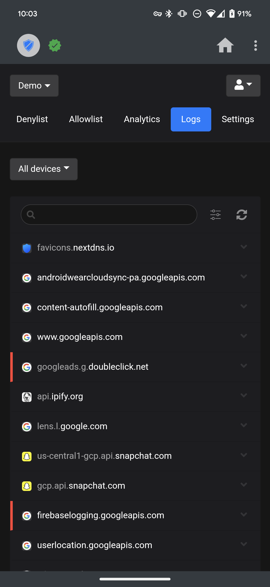

# NextDNSManager
     

      

      

      

## Issues
- To report an issue, please open a new issue in this repository.
- Please make sure to include the following info:
  - Device you're running the app on
  - Version of Android you're using
  - Version of the app you're using
  - Detailed description of your problem

## Suggestions/Feedback
- To make a suggestion or to report feedback, please open a new issue in this repository.
- Please make sure to inclide the following info:
  - Detailed description of your suggestion or feedback.

## Security Policy
### Supported Versions

| Version | Supported          |
| ------- | ------------------ |
| > 4.x   | :white_check_mark: |
| < 4.x   | :x:                |

### Reporting a Vulnerability

- Please open an issue and include the following information:
  - Device you're running the app on
  - Version of Android you're using
  - Version of the app you're using
  - Detailed description of the vulnerability
