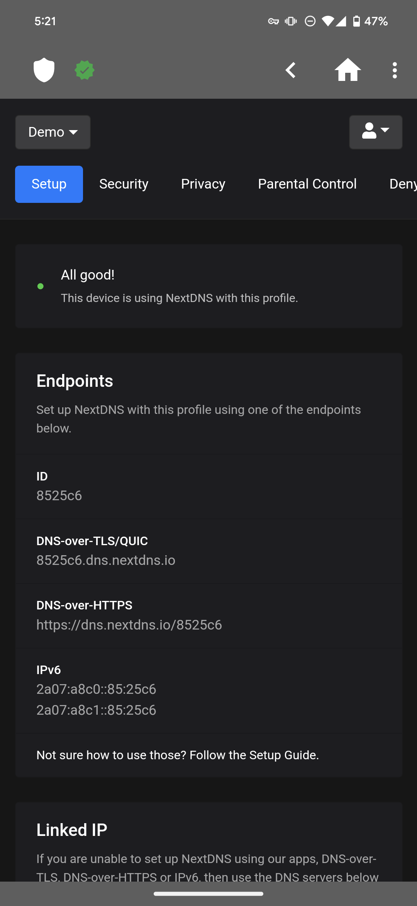

  
  
  
  
  
  
  

  
  
  

 
  

# About

NextDNS Manager is an Android application that simplifies the management of your [NextDNS](https://nextdns.io) configuration. NextDNS is a cloud-based DNS filter and firewall that protects your home, family, and privacy online. With NextDNS Manager, you can easily control your NextDNS settings and ensure a safer and more secure online experience.

NextDNS Manager can be installed on any Android phone or tablet running Android 10+.

**Note**: NextDNS Manager is a completely open-source project with no official ties to NextDNS.

# Features:

- **Intuitive Interface**: NextDNS Manager provides a user-friendly interface that allows you to manage your NextDNS settings with ease. The interface also includes Material You styling, automatic dark mode, as well as a dynamic/themed icon. The application also supports 14 languages!

- **Configuration Management**: You can configure your NextDNS settings, including filtering modes, blocklists, and whitelists.

- **Real-time Statistics**: Get insights into your DNS queries, blocked requests, and security events in real-time.

- **Security and Privacy**: Enhance your online security and privacy by leveraging NextDNS' filtering capabilities.

- **Easy Installation**: You can download and install NextDNS Manager from the Google Play Store, F-Droid, or directly from GitHub, providing multiple installation options.
# Installation

## Which installation method should I use?

It depends on your privacy preferences and how often you wish to receive updates.

- If you are able to use Google Play, use it.
- If you're not able to use Google Play, sideloading an APK from this repository is your next best option.

For each build ("version") of the app, there are timelines for when the build will be available, so methods with longer timelines will result in longer wait times for updates.

|                  | Google Play   | Sideloaded APK | F-Droid       |
| ---------------- | ------------- | -------------- | ------------- |
| **Availability** | A few minutes | A few minutes  | Up to 14 days |

F-Droid takes much longer than any of the other methods because they have a human involved in the process, each app is signed by a human on a computer that is air-gapped (not connected to the internet).

## Google Play Store

NextDNS Manager is available on the Google Play Store [here](https://play.google.com/store/apps/details?id=com.doubleangels.nextdnsmanagement).

## F-Droid Installation

NextDNS Manager is available on F-Droid [here](https://f-droid.org/en/packages/com.doubleangels.nextdnsmanagement).

## Manual Installation

The most recent APK is available for download [here](https://github.com/doubleangels/NextDNSManager/releases).

# Terms & Conditions/Privacy Policy

- [Privacy Policy](https://doubleangels.github.io/privacyPolicy/nextdns.html)
- [Terms and Conditions](https://doubleangels.github.io/privacyPolicy/nextdns_terms.html)

# Donations

- Donations are always optional.
- [Donate Here](https://donate.stripe.com/4gw8yhbvH0mg6SQ7ss)

# License

NextDNS Manager is open-source and released under the [GPLv3](LICENSE).

# Reporting Issues

If you encounter any issues while using NextDNS Manager, I encourage you to report them to me. To ensure a smooth resolution process, please follow these guidelines:

- **Device Information**: Provide details about the device you're running the app on.
- **Android Version**: Specify the version of Android you're using.
- **App Version**: Include the version of the NextDNS Manager app you're using.
- **Detailed Description**: Clearly describe the problem you're experiencing, including any relevant error messages or behaviors.

Please open a new issue in this repository to report the problem.

# Suggestions and Feedback

Your suggestions and feedback are valuable to me as they help me improve NextDNS Manager. If you have any ideas for enhancements or feedback to share, please do so by opening a new issue in this repository. Be sure to provide a detailed description of your suggestion or feedback.

# Contributing

I welcome contributions to NextDNS Manager from the community. Whether it's bug fixes, new features, or improvements to documentation, your contributions make a significant difference.

## How Can You Contribute?

You can contribute to NextDNS Manager in various ways:

### Reporting Bugs

If you encounter a bug in the project, please open an issue and include the following details:

- A clear and concise description of the bug.
- Steps to reproduce the bug.
- Expected behavior versus actual behavior.

### Suggesting Enhancements

If you have ideas for enhancing NextDNS Manager, feel free to open an issue to describe your suggestions. Provide as much detail as possible to help me understand your proposal better.

### Documentation

Improvements to the project's documentation are always welcome. You can suggest edits, updates, or new sections to make it more informative and user-friendly.

### Translations

If you notice inaccuracies in translations, please open an issue to report them. You can also contribute to translations and locales [here](https://crowdin.com/project/nextdns-manager).

### Code Contributions

For those interested in making code contributions, please open a pull request with your proposed changes. Automated tests must pass for your pull request to be merged.

## Getting Started

To get started with contributing:

- Check for any open issues related to the area you want to contribute to.
- If there's an existing issue, comment to express your interest in working on it.
- If no relevant issue exists, feel free to create one to discuss and coordinate your contributions.

## Security Policy

### Reporting a Vulnerability

I take security seriously. If you discover a vulnerability, I appreciate your help in disclosing it to me in a responsible manner. Please follow these guidelines when reporting security vulnerabilities:

1. **Privately Disclose**: Please avoid publicly disclosing the vulnerability until I have had a chance to address it. Instead, report it to me privately.

2. **Provide Details**: When reporting a vulnerability, please provide me with sufficient details to understand and reproduce the issue. Include information such as the device you're running the app on, the version of Android you're using, the version of the app you're using, and a detailed description of the vulnerability.

3. **Responsible Disclosure**: Allow me a reasonable amount of time to address the vulnerability before disclosing it publicly.

We appreciate your efforts in helping me maintain the security of NextDNS Manager. Thank you for your cooperation.
